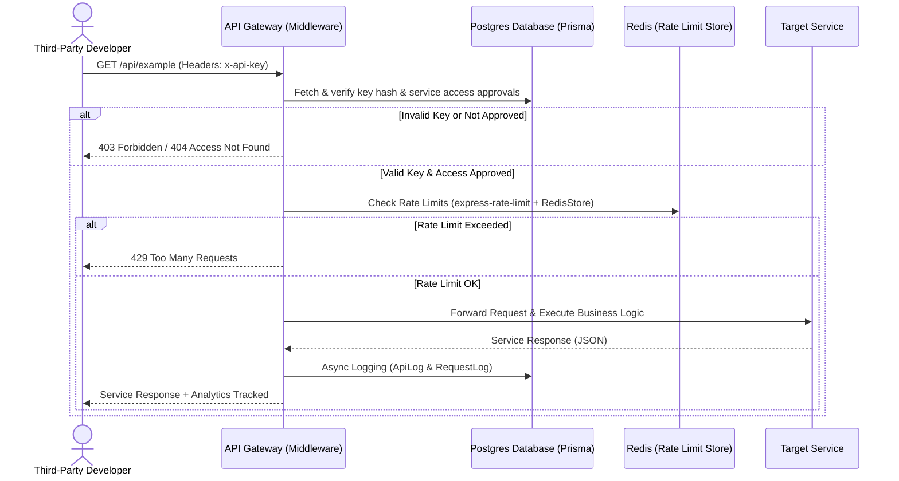

# ⚡ ApiForge: Full-Stack API Gateway & Developer Platform

ApiForge is a high-performance, developer-centric **API Gateway and Developer Portal** designed for service providers to securely publish, monitor, and manage backend services, and for third-party developers to discover and consume APIs.

It replicates the core capabilities of cloud API management tools like **RapidAPI** and **AWS API Gateway**, managing developer onboarding, API key lifecycle, route access approvals, rate limiting, and real-time analytical monitoring.

---

## 🗺️ System Architecture Flow

The API Gateway intercepts all requests to downstream services, performing authorization, rate limiting, and log generation before routing.



---

## 🌟 Key Features

### 🛡️ API Gateway & Security
* **JWT Authentication**: Secure login/signup system with role-based routing (User vs Admin).
* **API Key Generation & Hashing**: SHA-256 secure storage of api keys (`sk_...`). Raw keys are shown only once upon creation.
* **Granular Access Control**: RBAC-backed dynamic approval flow. Developers can request access to specific APIs; admins review and approve/reject requests.
* **Rate Limiting**: Distributed rate-limiting via **Redis** to prevent DDoS attacks and enforce service tiers.

### 📊 Real-Time Analytics & Dashboard
* **Dynamic Charting**: Recharts-powered graphs displaying Request Volume, Success Rates, and Latency trends.
* **Comprehensive Metrics**: Centralized admin dashboard monitoring total platform usage, error frequency, response latency, and active API keys.
* **Detailed Logs**: Developer audit logs reflecting time-stamped status codes and response times for troubleshooting.

---

## 🛠️ Tech Stack

| Component | Technology | Description |
| :--- | :--- | :--- |
| **Frontend** | React (Vite) | Single Page Application (SPA) development |
| **Animations** | Framer Motion | Smooth, modern page transitions and interactive micro-animations |
| **Charts** | Recharts | Visual charts for API analytics |
| **Backend** | Node.js (Express) | Scalable gateway routing and control plane |
| **ORM** | Prisma ORM | Elegant schema modeling and Postgres query builder |
| **Database** | PostgreSQL | Relational storage for users, services, keys, and logs |
| **Caching/Store** | Redis | Fast in-memory key-value database for rate limiting |
| **Validations** | Zod | Robust request payload schema parsing |
| **Security Headers**| Helmet | HTTP headers security hardening |

---

## ⚙️ Environment Configuration

### Backend (`/backend/.env`)
```env
PORT=5000
JWT_SECRET=your_super_secret_jwt_key
DATABASE_URL="postgresql://<username>:<password>@<host>:<port>/<db_name>"
REDIS_URL="redis://<host>:<port>"
```

### Frontend (`/frontend/.env`)
```env
VITE_API_URL="http://localhost:5000"
```

---

## 🚀 Quick Start & Setup

### Prerequisites
* **Node.js** (v18 or higher)
* **PostgreSQL** instance running
* **Redis** instance running

### 1. Database Setup (Prisma)
Initialize, run migrations, and seed default data (creates admin user, service, and dummy logs):
```bash
cd backend
npm install

# Run database migrations
npx prisma migrate dev --name init

# Seed the database
node prisma/seed.js
```

### 2. Run the Control Plane (Backend)
```bash
npm run dev
# Server runs on http://localhost:5000
```

### 3. Run the Client Dashboard (Frontend)
```bash
cd ../frontend
npm install
npm run dev
# SPA client runs on http://localhost:5173 (or next available port)
```

---

## 🧪 End-to-End API Flow Walkthrough

Once servers are running, here is how you test the gateway cycle end-to-end:

### Step 1: Authentication
1. **Register** a new account:
   * **POST** `http://localhost:5000/auth/register`
   * Body: `{ "email": "dev@test.com", "password": "password123" }`
2. **Login** to obtain your JWT token:
   * **POST** `http://localhost:5000/auth/login`
   * Body: `{ "email": "dev@test.com", "password": "password123" }`
   * *Response: Save the `"token"` value.*

### Step 2: Request & Approve Service Access
1. **Browse & Request Access** (as Developer):
   * **POST** `http://localhost:5000/service-access`
   * Headers: `Authorization: Bearer <JWT_TOKEN>`
   * Body: `{ "serviceId": 1 }`
2. **Approve Access** (as Admin):
   * **PUT** `http://localhost:5000/service-access/1/approve`
   * Headers: `Authorization: Bearer <ADMIN_JWT_TOKEN>`

### Step 3: API Key Management
1. **Generate API Key** (as Developer):
   * **POST** `http://localhost:5000/apikeys`
   * Headers: `Authorization: Bearer <JWT_TOKEN>`
   * Body: `{ "name": "Production Key" }`
   * *Response: Save the returned `"key"` (e.g., `sk_...`).*

### Step 4: Consume Service through Gateway
1. **Call Gateway Protected Service**:
   * **GET** `http://localhost:5000/api/example`
   * Headers: `x-api-key: <YOUR_API_KEY>`
   * *Output: Returns service output and logs telemetry.*
   